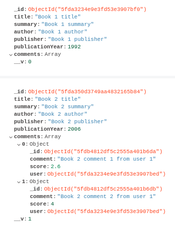

# Nodebooks

This is a [Node](https://nodejs.org/en/) project that exposes a REST API, developed with [Express](https://expressjs.com/) and [Mongoose](https://mongoosejs.com/) implementing Authentication and Auhorization using [JWT](https://www.jwt.io/). All the information is stored in a [mongoDB](https://www.mongodb.com/) database.

It implements the following [scenario](doc/scenario.md). It has been developed using [Visual Studio Code](https://code.visualstudio.com/) as IDE.

## Deploying infrastructure

Is needed to run the application the deployment of mongoDB instance:

```
$ docker-compose up
```

If you wish to launch the containers in background, include ```-d```

The running database has these connection details:

  * port: ```27017```
  * database: ```booksDB```

## Installation

In order to download needed dependencies is needed to execute the following command from root folder:

```
$ npm install
```

## Deploying the application

```
$ node src/server.js
```

When the application is deployed the following data is loaded (in order to check database content is recommended to user some mongo client like [Compass](https://www.mongodb.com/products/compass)) in collections of ```booksDB``` database:

### books



### users

Both users has the same password: ```password``` but appears encoded, as it is stored in this way in order for security purpose.


**If you have the application running and you stop and start it, all existing data in database are overwritten by previously described data**, providing in each application start a clean environmment.

## Testing

A [Postman](https://www.postman.com/) collection is provided in the current repository [Practice4-security-node.postman_collection.json](Practice4-security-node.postman_collection.json) to easily play and test the application.

It contains all needed data to test each endpoint immediately but you have to set value of these environment variables (Edit the collection and set them in Variables tab):

| NAME     | VALUE                                                    |
|----------|----------------------------------------------------------|
| baseUrl  | https://localhost:3443                                   |
| jwtToken | execute Login request in auth folder to retrieve a token |

The ```jwtToken``` value has been used in **Authorization** header, that you can find in Headers tab of Postman

The collection contains three main folders:

### anonymous

Exposes the operations that the not registered users can execute: create a user and get the books of the system with some information.


### auth

Exposes the login endpoint needed to get a JWT in order to  be able to execute the requests of **api/v1** folder and also the Who am I request that query the ```/api/v1/users/auth/me``` endpoint that receives a token in headers and returns the data of the user in the token.


### api/v1


## Author

[David Rojo(@david-rojo)](https://github.com/david-rojo)
